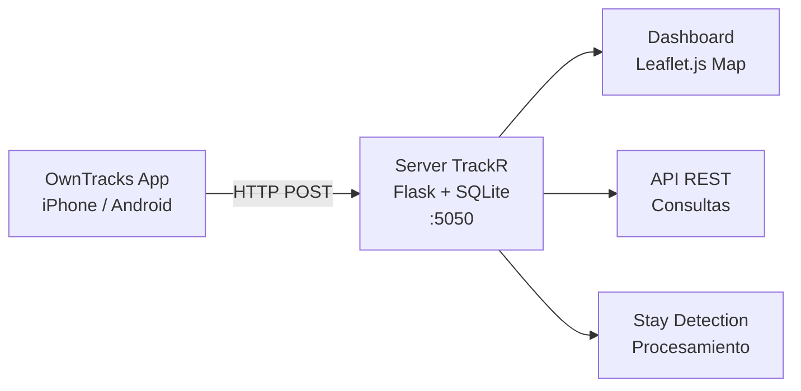

# 🗺️ TrackR - Personal Route Tracker

Sistema de tracking de ubicación propio, inspirado en Google Timeline pero con control total sobre los datos.

## Arquitectura



## Endpoints

### Recibir ubicación (OwnTracks)

```
POST /owntracks
Content-Type: application/json

{
  "_type": "location",
  "lat": 19.0535,
  "lon": -98.1727,
  "tst": 1234567890,
  "tid": "AB",
  "acc": 20,
  "batt": 85,
  "vel": 5
}
```

### Consultar ubicaciones

```
GET /api/locations              # Todas (limit=5000)
GET /api/locations?device=AB    # Filtrar por dispositivo
GET /api/locations?start=UNIX&end=UNIX  # Por rango de tiempo
GET /api/locations/today        # Hoy
GET /api/locations/recent?minutes=60   # Última hora
```

### Dispositivos

```
GET /api/devices    # Lista de dispositivos que han reportado
GET /api/stats      # Estadísticas generales
```

### Rutas (resúmenes)

```
GET /api/routes?date=2026-07-30   # Rutas de un día
POST /api/route/summary           # Guardar resumen de ruta
```

### Dashboard

```
GET /    # Mapa web interactivo
GET /health  # Health check
```

## Setup OwnTracks

> **Android**: La configuración es prácticamente idéntica. No ha sido probado formalmente con TrackR, pero OwnTracks en Android usa el mismo protocolo HTTP. La diferencia principal es que en Android necesitas poner la app en "no restringir" en ajustes de batería.

### 1. Instalar OwnTracks
- **iOS**: App Store → buscar "OwnTracks" → instalar (gratis)
- **Android**: Google Play → buscar "OwnTracks" → instalar (gratis)

### 2. Configurar permisos
- **Ubicación**: Siempre (no "Al usar la app")
- **Notificaciones**: Activar

### 3. Configurar servidor
1. Abrir OwnTracks → Settings (engranaje)
2. **Connection** → Selection: HTTP
3. **HTTP** → URL: `http://YOUR_SERVER_IP:5050/owntracks`
4. **HTTP** → Method: POST
5. **HTTP** → Content-Type: application/json

### 4. Configurar tracking
1. Settings → **Location** → Tracking mode: **Significant**
2. Settings → **Location** → Distance filter: 50 metros
3. Settings → **Location** → Watch interval: 120 segundos

### 5. Modos de monitoreo

| Modo | Uso | Batería |
|------|-----|---------|
| **Significant** (default) | Solo cuando te mueves ~500m | ✅ Baja |
| **Move mode** | Actualización continua | ⚠️ Media |
| **Manual** | Solo cuando abres la app | ✅ Muy baja |

### 6. Activar/Desactivar tracking
- **Para activar**: Abrir OwnTracks → tocar el botón de modo → "Move" o "Significant"
- **Para desactivar**: Cambiar modo a "Manual" o cerrar la app
- **Geofences**: Configurar regiones para automatizaciones (ej: "al llegar a casa, desactivar")

## Certificado SSL (solo iOS con Tailscale)

Si el server está en Tailscale con HTTPS, iOS no acepta certificados autofirmados por defecto. Sigue estos pasos:

### Generar certificado (en el server)
```bash
openssl req -x509 -newkey rsa:2048 -keyout key.pem -out cert.pem -days 365 -nodes \
  -subj "/CN=YOUR_SERVER_IP" \
  -addext "subjectAltName=IP:YOUR_SERVER_IP"
```

### Instalar en iPhone
1. Abrir navegador → `https://YOUR_SERVER_IP:5050/static/trackr-cert.pem`
2. Ajustes → General → Gestión de dispositivo → Instalar perfil
3. Ajustes → General → Acerca de → Ajustes de certificados → Activar confianza

### Configurar en OwnTracks
1. Settings → TLS → Activado
2. Settings → TLS → Trust untrusted certificates → Activado
3. URL: `https://YOUR_SERVER_IP:5050/owntracks`


## Dashboard

Accede al mapa desde:
```
http://YOUR_SERVER_IP:5050/
```

### Funciones:
- 📅 Ver ubicaciones de hoy
- ⏱️ Última hora / últimas 6 horas
- 🌐 Ver todo el historial
- 🔄 Auto-refresh cada 30 segundos
- 📍 Filtrar por dispositivo
- 📅 Seleccionar fecha específica
- 📊 Estadísticas en tiempo real

## Uso con agentes

Un agente puede consultar las rutas via API:

```bash
# Ver ubicaciones de hoy
curl http://YOUR_SERVER_IP:5050/api/locations/today

# Ver rutas de un día específico
curl http://YOUR_SERVER_IP:5050/api/routes?date=2026-07-30

# Guardar resumen de ruta
curl -X POST http://YOUR_SERVER_IP:5050/api/route/summary \
  -H "Content-Type: application/json" \
  -d '{
    "device_id": "AB",
    "date": "2026-07-30",
    "start_time": "09:00:00",
    "end_time": "10:30:00",
    "start_lat": 19.05,
    "start_lon": -98.17,
    "end_lat": 19.10,
    "end_lon": -98.20,
    "total_distance_km": 12.5,
    "total_duration_min": 90,
    "point_count": 45,
    "purpose": "Entrega CNC",
    "notes": "Ruta por libramiento"
  }'
```

## Archivos

```
trackr/
├── app.py              # Flask endpoint principal
├── models.py           # Modelos de base de datos
├── config.py           # Configuración
├── requirements.txt    # Dependencias
├── trackr.service      # Servicio systemd
├── README.md           # Esta documentación
├── data/
│   └── trackr.db       # Base de datos SQLite
├── templates/
│   └── dashboard.html  # Dashboard web con mapa
└── static/             # Assets estáticos
```


## Database Schema

### locations (GPS points from OwnTracks)
| Column | Type | Description |
|--------|------|-------------|
| id | INTEGER | Primary key |
| device_id | TEXT | Device identifier (e.g. "FM") |
| lat, lon | REAL | GPS coordinates |
| timestamp_unix | INTEGER | Unix timestamp |
| timestamp_local | TEXT | Local datetime string |
| accuracy | REAL | GPS accuracy in meters |
| battery | INTEGER | Battery percentage |
| speed | REAL | Speed in m/s |
| altitude | REAL | Altitude in meters |
| tag | TEXT | "personal" or "ruta" |
| route_id | INTEGER | Links to routes table |

### routes (manual route summaries)
| Column | Type | Description |
|--------|------|-------------|
| id | INTEGER | Primary key |
| device_id | TEXT | Device identifier |
| tag | TEXT | "personal" or "ruta" |
| date | TEXT | Route date (YYYY-MM-DD) |
| start_time, end_time | TEXT | Time range |
| start_lat/lon, end_lat/lon | REAL | Start/end coordinates |
| total_distance_km | REAL | Total distance |
| total_duration_min | INTEGER | Duration in minutes |
| point_count | INTEGER | Number of GPS points |

### moto_state (route mode toggle)
| Column | Type | Description |
|--------|------|-------------|
| id | INTEGER | Always 1 (singleton) |
| is_active | INTEGER | 0=off, 1=on |
| started_at | TEXT | ISO timestamp when activated |
| route_id | INTEGER | Current route ID |
| points_collected | INTEGER | Points collected in this session |

### processed_visits (auto-generated by stay detection)
| Column | Type | Description |
|--------|------|-------------|
| id | INTEGER | Primary key |
| device_id | TEXT | Device identifier |
| lat, lon | REAL | Visit center coordinates |
| start_ts, end_ts | INTEGER | Unix timestamps |
| start_local, end_local | TEXT | Local datetime strings |
| duration_min | INTEGER | Duration in minutes |
| point_count | INTEGER | GPS points in this visit |
| tag | TEXT | "personal" or "ruta" |

### processed_routes (auto-generated between visits)
| Column | Type | Description |
|--------|------|-------------|
| id | INTEGER | Primary key |
| device_id | TEXT | Device identifier |
| from_lat/lon, to_lat/lon | REAL | Route start/end coordinates |
| start_ts, end_ts | INTEGER | Unix timestamps |
| distance_km | REAL | Calculated distance |
| duration_min | INTEGER | Duration in minutes |
| tag | TEXT | "personal" or "ruta" |
## Instalación en server

> **Recomendado:** Raspberry Pi Zero 2W (512MB RAM). Ultraligero: Flask + SQLite + Gunicorn.

```bash
cd ~/trackr
python3 -m venv venv
source venv/bin/activate
pip install -r requirements.txt

# Probar
python app.py

# Instalar servicio
sudo cp trackr.service /etc/systemd/system/
sudo systemctl daemon-reload
sudo systemctl enable trackr
sudo systemctl start trackr
```

## Seguridad (TODO)

- [ ] Agregar autenticación al endpoint
- [ ] HTTPS con Let's Encrypt o certificado auto-firmado
- [ ] Rate limiting
- [ ] API key para consultas externas (agentes)

---

**Creado:** 31 julio 2026
**Autor:** BeStackDevelopment / subfire
